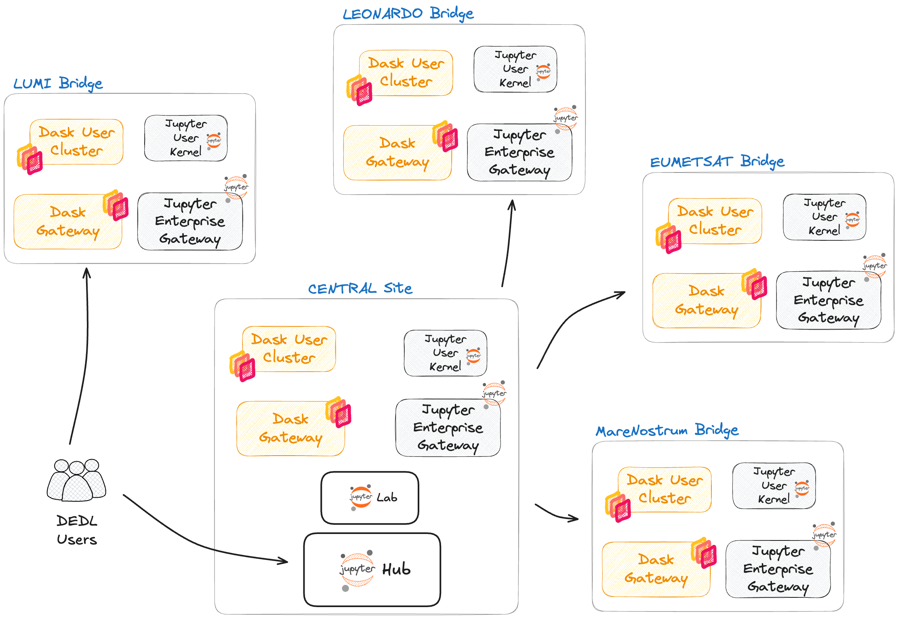

# DestinE-DEDL-Webinar-STACK

The core service of the Destination Earth Data Lake (DEDL) is the Harmonised Data Access Service (HDA). Next to this key service a set of so called DEDL Edge Services is provided to users upon request. The family of STACK services represent one flavour of Edge Services. STACK services are ready-to-use, multi-tenant applications/environments such as JupyterHub, Jupyter Enterprise Gateway and Dask.

## Data proximate compute
The credo of the DEDL is that the most efficient processing happens close to the data. Processing close to the data reduces the need of moving data across different geographically distributed locations. Accordingly, network traffic will be reduced resulting in energy savings, improved performance of workloads and even better scaleability. The DEDL STACK services addresses this via dedicated deployments of the service offering on each of the DestinE bridges. The figure below depicts a high-level architecture of the STACK service family and the deployment status of it.

Key facts:

- Service deployed across 5 different bridges across Europe.
- Processing close to the data by collocating services.
- STACK service family consists of 3 services to be consumed individually or together.



## Webinar Part 1: STACK JupyterHub 101
- Persistent user workspace
  - pre-pulled **DestinE-DataLake-Lab**
- Pre-configured development environment
  - DEDL Python Kernel
  ```
    mamba list -n python_dedl
  ```
  - JupyterLab extensions (Git, eodag-lab-extension, jupyterlab-s3-browser)
    - eodag-lab-extension
      - Example, select dedl (Provider), Product Type: EO.EUM.DAT.METOP.ASCSZF1B, 11/11/2025 to 19/11/2025
      - "Preview Results"
      - Go back, open an empty notebook and click "Generate Code"
      - Go back to "Preview results" again, select one item and click generate code
      - execute the code in the notebook
  - CLI tools (s3cmd, ...) 

### How to get a source code repository cloned into JupyterLab?

We will clone this repository to the persistent user workspace.

### How to incorporate Islet Storage Service?
List buckets via Python vs. JupyterLab S3 Browser vs s3cmd

[Example Notebook](01-s3-access.ipynb)


### DEDL STACK service Dask

Introduction to the service

[Reference Notebook](02-dask.ipynb)

## Webinar Part 2: Pakistan Flood Use Case

https://github.com/destination-earth/DestinE_EUMETSAT_PakistanFlood_2022
